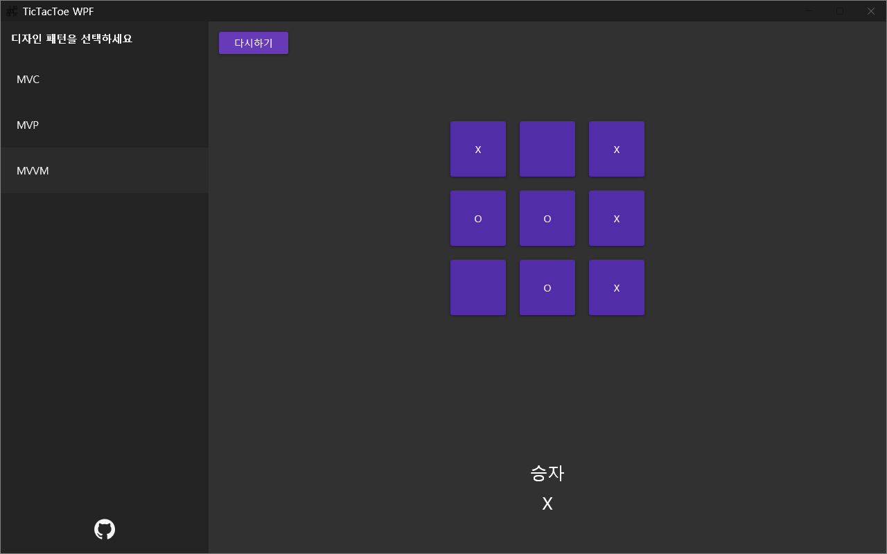

# wpf-TicTacToe-example

Example TicTacToe game project of MVC, MVP, MVVM design patterns.  
This project is conversion of Eric Maxwell's TicTacToe for android.

Nuget Dependancy

FluentWPF  
MaterialDesignInXaml

---

MVC, MVP, MVVM 패턴의 예시를 보여주기 위한 틱택토 게임입니다.  
Eric Maxwell이 만든 안드로이드 예시 어플리케이션을 WPF로 재작성했습니다.

다음 Nuget 패키지에 대한 의존성이 있습니다.

FluentWPF  
MaterialDesignInXaml
